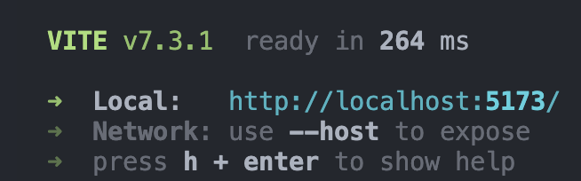

# College Tour Frontend

This folder contains all frontend code for the CS1D College Tour program.

## Running Frontend Code on LocalHost:

1. Pull latest changes to your machine.
2. In console, navigate to the parent folder "frontend".
3. run the following command in your console: `npm run dev`.
4. The following should appear in your console:

5. Navigate to the provided "Local" URL to view the site on your machine's local host
6. Once complete, enter `Ctrl+C` to end the session.